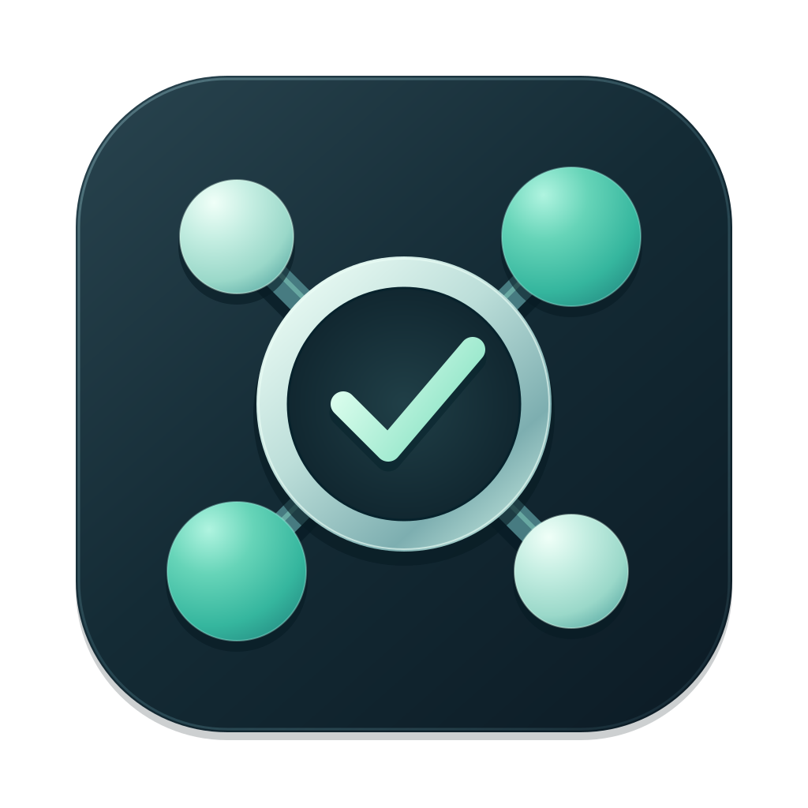
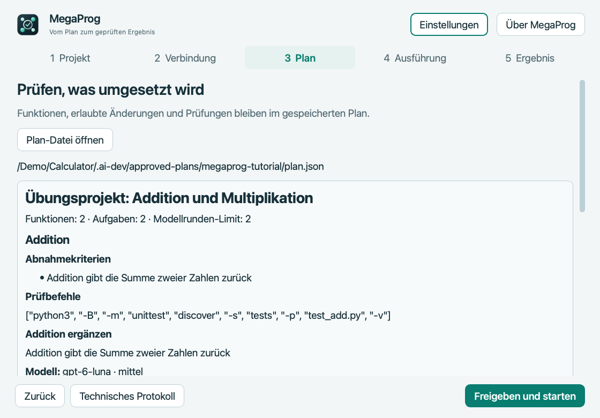
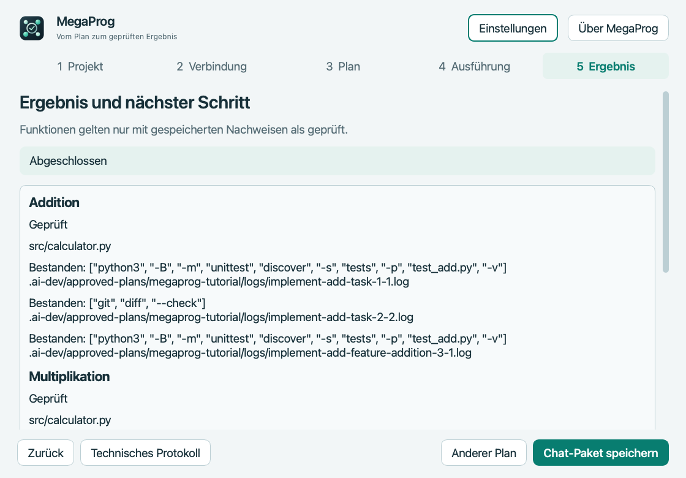

# MegaProg

**[Für macOS herunterladen](https://github.com/popovantondev/MegaProg/releases) · [Deutsch](README.de.md) · [Русский](README.ru.md) · [English](README.md)**

**Apple Silicon · 4.5.1 Preview (Vorschauversion) · GPL-3.0-only**

<p align="center"><br><strong>Plan freigeben. Ausführen. Fortschritt behalten.</strong></p>

MegaProg ist eine macOS-App, die freigegebene Entwicklungspläne mit OpenAI Codex ausführt. Sie speichert Anforderungen und Fortschritt im Projekt, bearbeitet Aufgaben nacheinander und führt die Prüfungen aus dem Plan aus.

## Demo: zwei Rechenfunktionen

 

Die Bilder zeigen den Übungsplan und seinen Abschluss nach zwei echten Codex-Arbeitsrunden. Der Text wurde für die Anzeige übersetzt, der Projektpfad durch einen Platzhalter ersetzt und private Daten sowie Nutzungswerte entfernt. [Russische](README.ru.md#пример-две-функции-калькулятора) und [englische](README.md#demo-two-calculator-functions) Bilder stehen in den jeweiligen Anleitungen.

**ChatGPT kann nicht auf Dateien auf Ihrem Mac zugreifen, solange Sie diese nicht anhängen.** Besprechen Sie das Ziel in ChatGPT, stellen Sie nötige Projektinformationen bereit, prüfen und bestätigen Sie den Plan und speichern Sie das endgültige JSON. Öffnen Sie es anschließend in MegaProg.

## Was MegaProg macht

- Speichert Anforderungen und Aufgaben außerhalb des Chatverlaufs.
- Führt Codex-Aufgaben nacheinander innerhalb eines gemeinsamen Modellrundenlimits aus.
- Führt die Prüfungen aus dem Plan aus und speichert deren Ergebnisse.
- Speichert den Fortschritt zum Pausieren und Fortsetzen.
- Zeigt Fortschritt, verfügbare Nutzungsdaten und den Grund für einen Stopp.

MegaProg garantiert weder, dass alle Anforderungen erfasst wurden, noch fehlerfreien Code oder einen geringeren Codex-Verbrauch als die direkte Arbeit mit Codex. Prüfen Sie Plan, Befehle, Änderungen und Ergebnisse.

## Erste Schritte auf macOS

Das Preview-Paket ist für **Apple-Silicon-Macs** vorgesehen. Die App ist ad hoc signiert, hat aber keine Apple-Developer-ID-Signatur und ist nicht notariell beglaubigt. macOS kann vor einem unbekannten Entwickler warnen. Öffnen Sie die App nur, wenn Sie Quellcode und Prüfsumme des Releases geprüft haben. Wenn Sie fortfahren möchten, bietet macOS nach dem ersten blockierten Start unter „Systemeinstellungen“ → „Datenschutz & Sicherheit“ die Option **Trotzdem öffnen** für diese App an. Gatekeeper nicht global deaktivieren. [Anleitung von Apple](https://support.apple.com/en-us/102445).

1. Laden Sie `MegaProg-4.5.1-macos-arm64.zip` aus den [Releases](https://github.com/popovantondev/MegaProg/releases) herunter.
2. Entpacken Sie das Archiv und verschieben Sie `MegaProg.app` in den Ordner „Programme“.
3. Öffnen Sie MegaProg. Mit „Mit Beispiel ausprobieren“ erstellen Sie ohne Terminal ein neues Übungsprojekt; alternativ wählen Sie ein bestehendes Git-Projekt. Klicken Sie dann auf „Verbindung prüfen“.
4. Melden Sie sich bei Codex mit einem ChatGPT-Konto an, das Codex-Zugriff hat. MegaProg entfernt API-Key-Umgebungsvariablen, verlangt die ChatGPT-Anmeldung und wechselt nicht zur kostenpflichtigen API.
5. Kopieren Sie die ChatGPT-Anleitung in MegaProg. Ein normaler Chat kann lokale Dateien nicht selbst ansehen: Hängen Sie passende Dateien an oder fügen Sie Projektdetails ein.
6. Bitten Sie ChatGPT, Ziel, Abnahmekriterien, Dateien, Prüfungen und Modellrundenbudget vorzuschlagen. Prüfen und bestätigen Sie diesen Vorschlag zuerst im Chat. Speichern Sie die endgültige Antwort als reines JSON.
7. Öffnen Sie die JSON-Datei in MegaProg. Prüfen Sie Funktionen, erlaubte Dateien und jeden Prüfungsbefehl. Das Öffnen startet nichts.
8. Klicken Sie auf „Freigeben und starten“ oder „Nur speichern“. Mit „Eine Aufgabe, dann Pause“ pausieren Sie zwischen Aufgaben. Zum Fortsetzen öffnen Sie MegaProg erneut und wählen den gespeicherten Plan.

Prüfungsbefehle sind ausführbare Programme. Sie laufen auf Ihrem Mac mit Ihrem Benutzerkonto. Geben Sie nur Pläne und Befehle aus Quellen frei, denen Sie vertrauen. Erstellen Sie ein Git-Backup und prüfen Sie Änderungen, bevor Sie sie verwenden oder veröffentlichen.

„Mit Beispiel ausprobieren“ erstellt einen neuen Git-Projektordner und öffnet den enthaltenen Plan für zwei Funktionen mit einem Limit von zwei Modellrunden. Bestehende Ordner werden nicht überschrieben. Codex startet erst nach Ihrer Freigabe. [Plan](examples/two-features/approved-plan.json) und [Beispielquellen](examples/two-features/project/README.md) liegen auch im Repository.

## Voraussetzungen

- macOS auf Apple Silicon für das Preview-Paket. Andere macOS-Versionen wurden noch nicht unabhängig geprüft.
- Eine separate Installation der Codex CLI mit ChatGPT-Anmeldung und Codex-Zugriff.
- Ein Git-Projekt. Pläne und Laufdaten werden in `.ai-dev/` im Projekt gespeichert.

Quellcode und Tests laufen außerdem mit Python 3.9 oder neuer. Für den App-Build benötigen Sie Python 3.12 mit PySide6 sowie die Werkzeuge aus `requirements-build.txt`.

## Aus dem Quellcode bauen

```sh
python3.12 -m venv .venv
source .venv/bin/activate
python -m pip install -r requirements-build.txt
python packaging/build.py --output /tmp/megaprog-release
```

Der Build erfordert einen sauberen Git-Checkout und speichert App, Quellcode, Prüfsummen und ZIP im gewählten Ordner. Siehe [Build und Release](docs/RELEASE.md).

## Datenschutz und Grenzen

MegaProg läuft lokal. Pläne, Status, Prüfprotokolle und Codex-Sitzungsreferenzen liegen unter `.ai-dev/` im ausgewählten Projekt. Prüfen oder löschen Sie diese Daten bei Bedarf. Dieses Repository enthält keine Codex-Anmeldedaten. Codex verarbeitet Aufgaben mit dem Konto und Workspace, bei dem Sie angemeldet sind. Ein Handoff kann lokale Pfade und Aufgabenbeschreibungen enthalten: Prüfen Sie ihn vor dem Anhängen an einen anderen Chat.

Informationen zur Mitarbeit: [CONTRIBUTING.md](CONTRIBUTING.md). Sicherheit: [SECURITY.md](SECURITY.md). Lizenz: [GPL-3.0-only](LICENSE). MegaProg ist ein unabhängiges Community-Projekt und kein OpenAI-Produkt.

## Neuer Assistent

Projekt → Verbindung → Plan → Ausführung → Ergebnis. Nach der Prüfung «Freigeben und starten» oder «Nur speichern» wählen. Gespeicherte Pläne werden im ersten Schritt ausdrücklich ausgewählt. System-, helles und dunkles Design sowie vollständige deutsche, russische und englische Oberfläche. Chat-Paket manuell in ChatGPT anhängen. Aus Quellcode: `python -m pip install ".[gui]"`.
