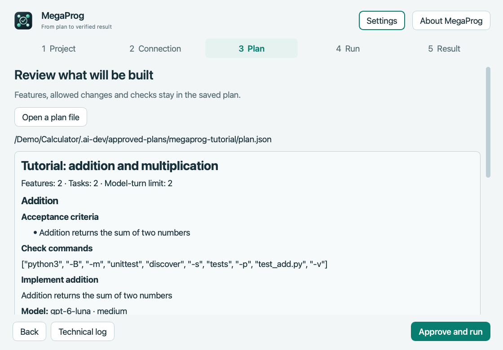

# MegaProg

**[Download for macOS](https://github.com/popovantondev/MegaProg/releases) · [Deutsch](README.de.md) · [Русский](README.ru.md) · [English](README.md)**

**Apple Silicon · 4.5.1 Preview · GPL-3.0-only**

<p align="center"><br><strong>Review a plan. Run it. Keep your progress.</strong></p>

MegaProg is a macOS desktop app that runs approved software plans through OpenAI Codex. It stores requirements and progress in your project, runs tasks one at a time, and performs the checks listed in the plan.

## Demo: two calculator functions

 

The screenshots show the tutorial plan and its completed state after two Codex worker turns. The display uses translated demo text and a placeholder project path; private project data and usage details are omitted. [German](README.de.md#demo-zwei-rechenfunktionen) and [Russian](README.ru.md#пример-две-функции-калькулятора) screenshots are available in their own guides.

**ChatGPT cannot see files on your Mac unless you attach them.** Discuss a goal in ChatGPT, provide relevant project details, review the proposed plan, and save the final JSON file. Open and approve it in MegaProg.

## What it does

- Keeps requirements and the task queue outside chat history.
- Runs Codex tasks in order within a shared model-turn budget.
- Runs plan-defined checks and saves their results.
- Saves progress so work can be paused and continued later.
- Shows progress, available usage data, and why a task stopped.

MegaProg does not guarantee that a plan captures every requirement, that generated code is correct, or that it saves Codex usage compared with working directly in Codex. Review the plan, commands, code changes, and results.

## Get started on macOS

The Preview package targets **Apple Silicon**. The app is ad-hoc signed; it has no Apple Developer ID signature and is not notarized. macOS may warn about an unidentified developer. Open it only after reviewing the source and checking the release checksum. If you choose to proceed, macOS offers a per-app **Open Anyway** action in System Settings → Privacy & Security after the first blocked launch. Do not disable Gatekeeper globally. [Apple's instructions](https://support.apple.com/en-us/102445).

1. Download `MegaProg-4.5.1-macos-arm64.zip` from [Releases](https://github.com/popovantondev/MegaProg/releases).
2. Unzip it and move `MegaProg.app` to Applications.
3. Open MegaProg. Click **Try the tutorial** to create a new tutorial project without using Terminal, or choose your existing Git project. Follow the **Project → Connection → Plan → Run → Result** steps and click **Check connection**.
4. Sign in to Codex with a ChatGPT account that has Codex access. MegaProg removes API-key environment variables and requires ChatGPT login; it does not fall back to the paid API.
5. Copy the ChatGPT instructions in MegaProg. ChatGPT cannot inspect your local project by itself, so attach relevant files or paste project details.
6. Ask ChatGPT to propose the goal, acceptance criteria, files, checks, and model-turn budget. Review and approve that proposal in the chat; save the final answer as plain JSON.
7. Open that JSON in MegaProg. Review the features, allowed files, and every verification command. Opening the file does not run anything.
8. Click **Approve and run**, or **Save without running**. Choose **One task, then pause** to stop between tasks. To resume, select the project and its saved plan, review it and confirm continuation.

Verification commands are executable programs. They run on your Mac under your user account. Approve plans and commands only from sources you trust. Keep a Git backup and review code changes before using or publishing them.

The **Try the tutorial** button creates a fresh Git project and opens the included two-function plan with a two-turn budget. It never overwrites an existing folder. Codex starts only after your explicit approval. The same [plan](examples/two-features/approved-plan.json) and [demo source](examples/two-features/project/README.md) are available in this repository.

## Requirements

- macOS on Apple Silicon for the Preview app. Other macOS versions have not been independently verified.
- Codex CLI installed separately and signed in to a ChatGPT account with Codex access.
- A Git project. Plans and run data are stored in that project's `.ai-dev/` directory.

Source and automated tests also work on Python 3.9 or later. Building the macOS app requires Python 3.12 and PySide6 and the pinned tools in `requirements-build.txt`.

## Build from source

```sh
python3.12 -m venv .venv
source .venv/bin/activate
python -m pip install -r requirements-build.txt
python packaging/build.py --output /tmp/megaprog-release
```

The release builder requires a clean Git checkout. It writes the app, source, checksums, and ZIP under the selected output directory. See [Build and release](docs/RELEASE.md).

## Privacy and limitations

MegaProg runs locally. Project plans, state, verification logs, and Codex session references are stored in `.ai-dev/` inside the selected project. Review or remove them when appropriate. This repository does not contain your Codex login. Codex processes tasks using the account and workspace you sign in with. Handoffs can contain local paths and task summaries; review them before attaching them to another chat.

See [Contributing](CONTRIBUTING.md), [Security](SECURITY.md), and the [GPL-3.0-only license](LICENSE). MegaProg is an independent community project, not an OpenAI product.

## Desktop appearance

System, light and dark themes; complete English, German and Russian interface. Preferences and recent projects stay local. The new centred node/check icon is shared by the app and documentation. From source, install the desktop extra with `python -m pip install ".[gui]"`.
