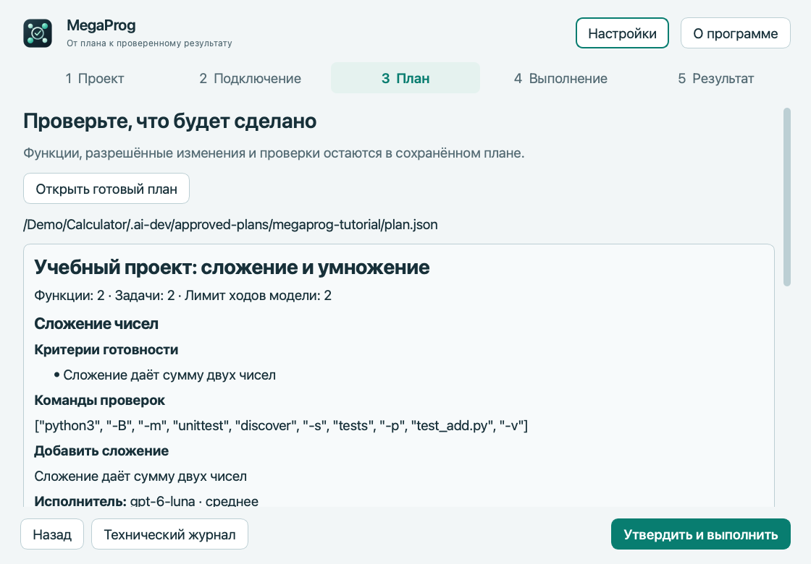
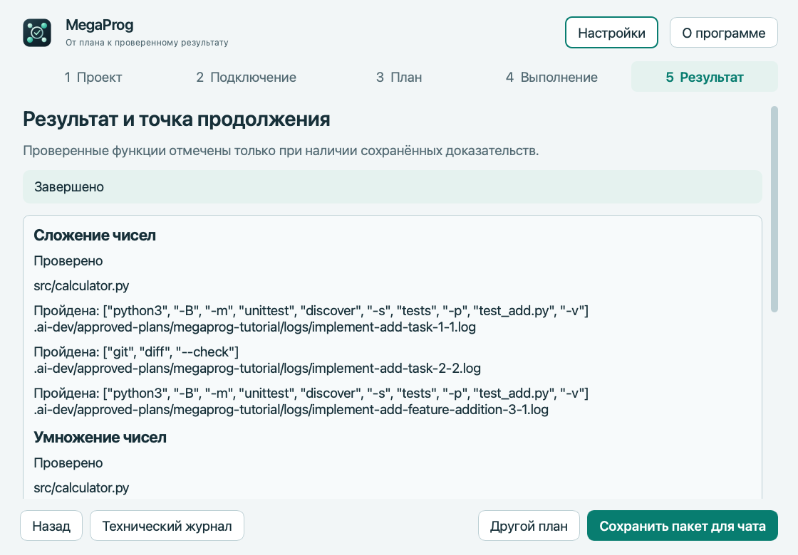

# MegaProg

<!-- public-release:start -->
Запускает согласованные задачи разработки через Codex и сохраняет требования, проверки и прогресс проекта.

**macOS · Apple Silicon · Предварительный выпуск 4.5.1**

**[Скачать](https://github.com/popovantondev/MegaProg/releases/tag/v4.5.1-preview.1)** · **[Инструкция](https://popovantondev.github.io/MegaProg/Guide-ru.html)** · **[Сообщить об ошибке](https://github.com/popovantondev/MegaProg/issues/new/choose)**

**Требования и ограничения:** Отдельно установите Codex CLI и войдите через аккаунт ChatGPT с доступом к Codex; нужен Git-проект. Приложение не нотарифицировано Apple.

**Первые шаги:** Распакуйте MegaProg.app, проверьте подключение и откройте учебный пример. Просмотрите план и команды перед разрешением запуска.

**Файлы приложения:**

- [`MegaProg-4.5.1-macos-arm64.zip`](https://github.com/popovantondev/MegaProg/releases/download/v4.5.1-preview.1/MegaProg-4.5.1-macos-arm64.zip)

**Контрольные суммы:** [`SHA256SUMS.txt`](https://github.com/popovantondev/MegaProg/releases/download/v4.5.1-preview.1/SHA256SUMS.txt)
<!-- public-release:end -->

**[Скачать для macOS](https://github.com/popovantondev/MegaProg/releases/tag/v4.5.1-preview.1) · [Deutsch](README.de.md) · [Русский](README.ru.md) · [English](README.md)**

**Apple Silicon · 4.5.1 Preview (Предварительная версия) · GPL-3.0-only**

<p align="center"><br><strong>Согласуйте план. Запустите его. Сохраните прогресс.</strong></p>

MegaProg — приложение для macOS, которое выполняет утверждённый план разработки через OpenAI Codex. Оно хранит требования и прогресс в проекте, выполняет задачи по очереди и запускает проверки из плана.

## Пример: две функции калькулятора

<a href="docs/screenshots/ru-plan.png"></a>

<a href="docs/screenshots/ru-result.png"></a>

Снимки показывают учебный план и состояние после двух настоящих ходов Codex. Текст плана для показа переведён; путь проекта заменён условным, личные данные и показатели расхода убраны. Скриншоты [на немецком](README.de.md#demo-zwei-rechenfunktionen) и [английском](README.md#demo-two-calculator-functions) находятся в соответствующих инструкциях.

**ChatGPT не видит файлы на вашем Mac, пока вы их не прикрепите.** Обсудите цель в ChatGPT, предоставьте нужные сведения о проекте, проверьте предложение, утвердите план и сохраните итоговый JSON. Затем откройте его в MegaProg.

## Что умеет MegaProg

- Хранит требования и очередь задач отдельно от истории чата.
- Выполняет задачи Codex по очереди в общем бюджете модельных ходов.
- Запускает проверки из плана и сохраняет результаты.
- Сохраняет прогресс для остановки и продолжения работы.
- Показывает прогресс, доступные данные о расходе и причину остановки.

MegaProg не гарантирует, что план учёл все требования, код всегда правильный или программа экономит расход Codex по сравнению с прямой работой в Codex. Проверяйте план, команды, изменения кода и результаты.

## Первый запуск на macOS

Пакет Preview предназначен для **Mac с Apple Silicon**. Приложение подписано ad hoc; у него нет подписи Apple Developer ID и нотариализации. macOS может предупредить о неизвестном разработчике. Открывайте приложение только после проверки исходников и контрольной суммы выпуска. Если вы решили продолжить, после первой блокировки macOS покажет действие **Open Anyway** для этого приложения в «Настройки системы» → «Конфиденциальность и безопасность». Не отключайте Gatekeeper целиком. [Инструкция Apple](https://support.apple.com/en-us/102445).

1. Скачайте `MegaProg-4.5.1-macos-arm64.zip` из раздела [Releases](https://github.com/popovantondev/MegaProg/releases/tag/v4.5.1-preview.1).
2. Распакуйте архив и переместите `MegaProg.app` в «Программы».
3. Откройте MegaProg. Нажмите «Попробовать на примере», чтобы создать учебный проект без Терминала, либо выберите существующий Git-проект. На шаге «Подключение» нажмите «Проверить подключение».
4. Войдите в Codex с аккаунтом ChatGPT, которому доступен Codex. MegaProg удаляет переменные окружения API-ключа, требует вход через ChatGPT и не переключается на платный API.
5. Скопируйте инструкцию для ChatGPT в MegaProg. Обычный чат сам не может просмотреть файлы на Mac: прикрепите нужные файлы или вставьте сведения о проекте.
6. Попросите ChatGPT предложить цель, критерии приёмки, файлы, проверки и бюджет ходов. Сначала проверьте и утвердите предложение в чате. Сохраните итоговый ответ как JSON без Markdown.
7. Откройте JSON в MegaProg. Просмотрите функции, разрешённые файлы и каждую команду проверки. Само открытие ничего не запускает.
8. Нажмите «Утвердить и выполнить» или «Сохранить без запуска». Для остановки между задачами выберите «Одна задача и пауза». Чтобы продолжить, снова откройте MegaProg и выберите сохранённый план.

Команды проверок — исполняемые программы. Они запускаются на Mac от имени вашей учётной записи. Утверждайте планы и команды только из источников, которым доверяете. Сделайте резервную копию Git и проверьте изменения до использования или публикации.

Кнопка «Попробовать на примере» создаёт новую папку с Git и открывает план из двух функций с бюджетом в два хода. Существующие папки не перезаписываются. Codex запускается только после вашего утверждения. Те же [план](examples/two-features/approved-plan.json) и [исходники примера](examples/two-features/project/README.md) доступны в репозитории.

## Что понадобится

- macOS на Apple Silicon для пакета Preview. Другие версии macOS пока не проверялись отдельно.
- Установленный отдельно Codex CLI с входом через аккаунт ChatGPT, которому доступен Codex.
- Git-проект. Планы и данные запуска хранятся в `.ai-dev/` внутри проекта.

Исходный код и тесты также работают с Python 3.9 и новее. Для сборки приложения нужен Python 3.12 с PySide6 и инструменты из `requirements-build.txt`.

## Сборка из исходников

```sh
python3.12 -m venv .venv
source .venv/bin/activate
python -m pip install -r requirements-build.txt
python packaging/build.py --output /tmp/megaprog-release
```

Для сборки нужен чистый Git checkout. Приложение, исходники, контрольные суммы и ZIP появятся в выбранной папке. Подробнее: [сборка и выпуск](docs/RELEASE.md).

## Данные и ограничения

MegaProg работает локально. Планы, состояние, журналы проверок и ссылки на сессии Codex находятся в `.ai-dev/` выбранного проекта. При необходимости просмотрите или удалите их. В репозитории нет вашего входа в Codex. Codex обрабатывает задачи с учётом аккаунта и рабочего пространства, куда вы вошли. Handoff может содержать локальные пути и сведения о задачах — проверьте его перед прикреплением к другому чату.

Информация для участников — [CONTRIBUTING.md](CONTRIBUTING.md), безопасность — [SECURITY.md](SECURITY.md), лицензия — [GPL-3.0-only](LICENSE). MegaProg — независимый проект сообщества, не продукт OpenAI.

## Новый мастер

Проект → Подключение → План → Выполнение → Результат. После просмотра нажмите «Утвердить и выполнить» или «Сохранить без запуска». Сохранённый план выбирается явно на первом шаге. Доступны системная, светлая и тёмная темы и полный русский, немецкий и английский интерфейс. Пакет для чата нужно прикрепить в ChatGPT вручную. При запуске из исходников установите интерфейс: `python -m pip install ".[gui]"`.
