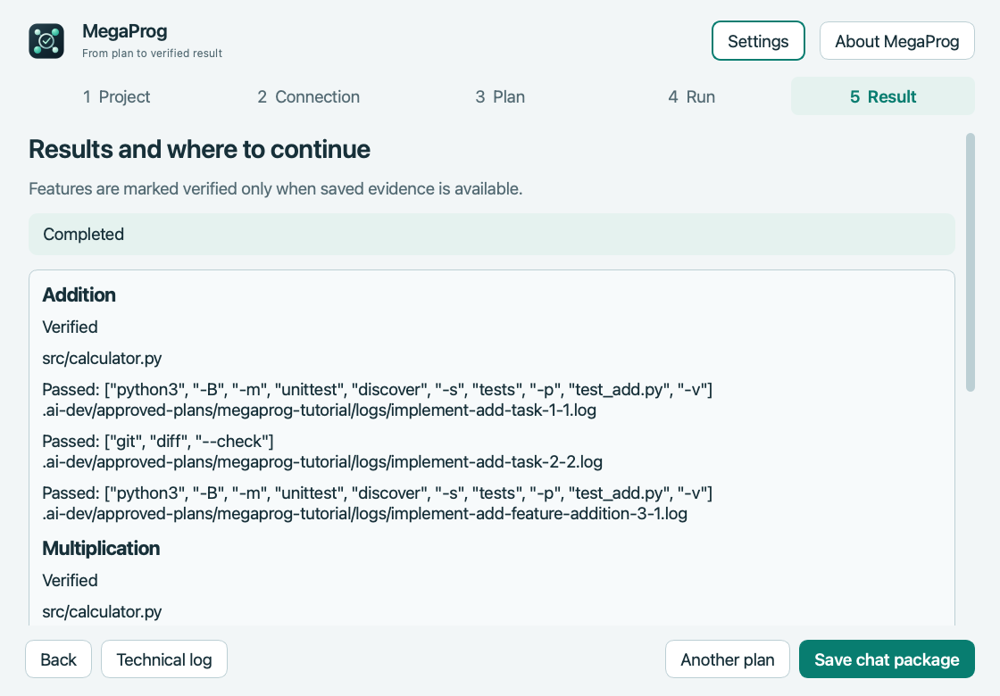

# MegaProg 4.5.1 Preview — release page draft

**[English](../README.md) · [Русский](../README.ru.md) · [Deutsch](../README.de.md)**

MegaProg helps you run a development plan that you reviewed and approved. It keeps the feature requirements and task queue in your project, runs approved tasks sequentially, performs the listed checks, and saves progress so you can continue later.

The demonstration shows two verified calculator functions after two worker turns. [Plan and result screenshots in all three languages](../README.md#demo-two-calculator-functions).

## Quick start

1. Set up the supported execution connector and subscription login using the [technical documentation](https://github.com/popovantondev/MegaProg/blob/main/docs/APPROVED_PLAN_MODE.md).
2. Open MegaProg, select **Try the tutorial** to create a demo Git project, or choose your own Git project; check the service connection.
3. Prepare a JSON plan. Review its files, checks, and execution budget before approving it.
4. Open the JSON plan, review every command, approve it, and start the run. Use the one-task action to pause between tasks, then continue the saved plan later.

Try the included [two-function example plan](../examples/two-features/approved-plan.json) in a copy of its [demo project](../examples/two-features/project/README.md). Reading a plan does not run it; execution starts only after approval.

## Downloads

- `MegaProg-4.5.1-macos-arm64.zip` — self-contained macOS app for Apple Silicon.
- `MegaProg-4.5.1-source.zip` — corresponding source and tests under GPL-3.0-only.
- `MegaProg-4.5.1-third-party-source.zip` — matching Qt and PySide6 sources and their verified upstream checksums.
- `SHA256SUMS.txt` — SHA-256 checksums for all three archives.

## Requirements and limits

The app bundle includes Python and Qt. A separate execution connector and subscription login are required. Tasks use the connected external service; no separately billed API fallback is used. See the technical setup documentation.

The app is ad-hoc signed but has no Apple Developer ID signature and is not notarized. Review the source and checksum before opening. macOS may require the per-app **Open Anyway** action. Do not disable Gatekeeper globally.

This first package targets Apple Silicon. Intel Mac and Windows are not verified. MegaProg does not guarantee quota savings or error-free results. Review every plan, check command, and code change.

## Verification

Built on Apple Silicon macOS 15.7.4. The final offline suite ran 556 tests: 553 passed, 3 skipped. A 4.5.1 build with the same application code completed both tutorial functions with the connected service in two task runs, including a pause and continuation without repeating the first task. The release archive was rebuilt after documentation and test-only changes. See `docs/PREVIEW_VALIDATION_REPORT.md` and the exact release receipt for package checks. This single trial does not establish quota savings.

## License

GPL-3.0-only. MegaProg is an independent community project.

## Roadmap and feedback

See the [public roadmap](PRODUCT_ROADMAP.md). After the repository is created, use its Issues page for bug reports and suggestions.

---

# Русский

MegaProg выполняет план, который вы проверили и утвердили. Программа хранит требования и очередь задач в проекте, последовательно выполняет задачи, выполняет указанные проверки и сохраняет прогресс для продолжения.

[Скриншоты плана и результата на трёх языках](../README.ru.md#пример-две-функции-калькулятора).

## Файлы

- `MegaProg-4.5.1-macos-arm64.zip` — автономное приложение для Mac с Apple Silicon.
- `MegaProg-4.5.1-source.zip` — соответствующие исходники и тесты под GPL-3.0-only.
- `MegaProg-4.5.1-third-party-source.zip` — исходники Qt и PySide6 с проверенными хэшами официальных архивов.
- `SHA256SUMS.txt` — контрольные суммы SHA-256 для всех трёх архивов.

## Условия и ограничения

В приложение включены Python и Qt. Отдельно нужны компонент подключения и вход по подписке. Задачи выполняются через подключённый внешний сервис. Отдельной платной API-оплаты нет; настройка описана в технической документации.

Приложение подписано ad hoc, но не имеет подписи Apple Developer ID и не нотариализировано. Перед запуском проверьте исходники и контрольную сумму. macOS может предложить действие **Open Anyway** для этого приложения. Не отключайте Gatekeeper полностью.

Первый пакет предназначен для Apple Silicon. Intel Mac и Windows не проверялись. MegaProg не гарантирует экономию лимитов или отсутствие ошибок. Проверяйте план, команды проверок и изменения кода.

## Быстрый старт

1. Настройте компонент подключения и вход по подписке по [технической документации](https://github.com/popovantondev/MegaProg/blob/main/docs/ru/APPROVED_PLAN_MODE.md).
2. Откройте MegaProg, нажмите «Попробовать на примере» для нового учебного Git-проекта или выберите свой проект; проверьте подключение сервиса.
3. Подготовьте JSON-план для MegaProg. До утверждения проверьте файлы, команды проверок и бюджет ходов.
4. Откройте JSON-план, проверьте каждую команду, утвердите запуск. Чтобы остановиться между задачами, запустите одну задачу; продолжить можно позже из сохранённого состояния.

Попробуйте [пример плана из двух функций](../examples/two-features/approved-plan.json) на копии [демо-проекта](../examples/two-features/project/README.md). Открытие плана ничего не запускает: выполнение начинается только после утверждения.

## Проверки

Сборка подготовлена для Apple Silicon на macOS 15.7.4. Итоговый офлайн-набор: 556 тестов, 553 пройдены, 3 пропущены. Сборка 4.5.1 с тем же кодом приложения выполнила обе учебные функции через подключённый сервис за два хода исполнителя: после паузы первая задача не повторилась. Архив выпуска пересобран после изменений только в документации и тесте. Подробнее — в `docs/ru/PREVIEW_VALIDATION_REPORT.md` и отчёте точного пакета. Один прогон не доказывает экономию лимитов.

## Лицензия

GPL-3.0-only. MegaProg — независимый проект сообщества.

## Roadmap и обратная связь

Смотрите [публичный план развития](PRODUCT_ROADMAP.md). После создания репозитория предложения и сообщения об ошибках можно будет отправлять через GitHub Issues.

---

# Deutsch

MegaProg führt einen Plan aus, den Sie geprüft und freigegeben haben. Die App speichert Anforderungen und Aufgabenwarteschlange im Projekt, startet freigegebene Aufgaben nacheinander, führt die angegebenen Prüfungen aus und speichert den Fortschritt zum späteren Fortsetzen.

[Plan- und Ergebnisbilder in drei Sprachen](../README.de.md#demo-zwei-rechenfunktionen).

## Downloads

- `MegaProg-4.5.1-macos-arm64.zip` — eigenständige macOS-App für Apple Silicon.
- `MegaProg-4.5.1-source.zip` — passender Quellcode und Tests unter GPL-3.0-only.
- `MegaProg-4.5.1-third-party-source.zip` — passende Qt- und PySide6-Quellen mit geprüften Upstream-Prüfsummen.
- `SHA256SUMS.txt` — SHA-256-Prüfsummen für alle drei Archive.

## Voraussetzungen und Grenzen

Python und Qt sind in der App enthalten. Ein separater Ausführungsanschluss mit Abonnement-Anmeldung ist erforderlich. Aufgaben werden über den verbundenen externen Dienst ausgeführt. Eine separate kostenpflichtige API wird nicht verwendet; die Einrichtung steht in der technischen Dokumentation.

Die App ist ad hoc signiert, hat aber keine Apple-Developer-ID-Signatur und ist nicht notariell beglaubigt. Prüfen Sie vor dem Öffnen Quellcode und Prüfsumme. macOS kann die app-spezifische Option **Trotzdem öffnen** anbieten. Gatekeeper nicht global deaktivieren.

Dieses erste Paket zielt auf Apple Silicon. Intel-Macs und Windows sind nicht geprüft. MegaProg garantiert weder geringeren Verbrauch noch fehlerfreie Ergebnisse. Prüfen Sie Plan, Befehle und Codeänderungen.

## Schnellstart

1. Richten Sie Ausführungsanschluss und Abonnement-Anmeldung nach der [technischen Dokumentation](https://github.com/popovantondev/MegaProg/blob/main/docs/de/APPROVED_PLAN_MODE.md) ein.
2. Öffnen Sie MegaProg, wählen Sie „Mit Beispiel ausprobieren“ für ein neues Übungsprojekt oder ein bestehendes Git-Projekt und prüfen Sie die Verbindung zum Dienst.
3. Erstellen Sie einen JSON-Plan für MegaProg. Prüfen Sie Dateien, Befehle und Rundenbudget vor der Freigabe.
4. Öffnen Sie den JSON-Plan, prüfen Sie jeden Befehl und geben Sie den Ablauf frei. Mit der Ein-Aufgaben-Option halten Sie zwischen Aufgaben an und setzen später fort.

Testen Sie den [Beispielplan mit zwei Funktionen](../examples/two-features/approved-plan.json) in einer Kopie des [Demo-Projekts](../examples/two-features/project/README.md). Das Öffnen startet nichts; die Ausführung beginnt erst nach der Freigabe.

## Prüfungen

Auf Apple Silicon mit macOS 15.7.4 vorbereitet. Abschließende Offline-Suite: 556 Tests, 553 bestanden, 3 übersprungen. Ein 4.5.1-Build mit demselben Anwendungscode erledigte beide Übungsfunktionen mit dem verbundenen Dienst in zwei Aufgabenläufen; nach der Pause wurde die erste Aufgabe nicht wiederholt. Das Release-Archiv wurde nach Änderungen nur an Dokumentation und Test neu gebaut. Details stehen in `docs/de/PREVIEW_VALIDATION_REPORT.md` und im Bericht zum genauen Paket. Dieser einzelne Lauf beweist keine Einsparung von Dienstkontingenten.

## Lizenz

GPL-3.0-only. MegaProg ist ein unabhängiges Community-Projekt.

## Roadmap und Feedback

Die [öffentliche Roadmap](PRODUCT_ROADMAP.md) zeigt den aktuellen Umfang. Nach Erstellung des Repositories können Sie Fehler und Vorschläge über GitHub Issues melden.
